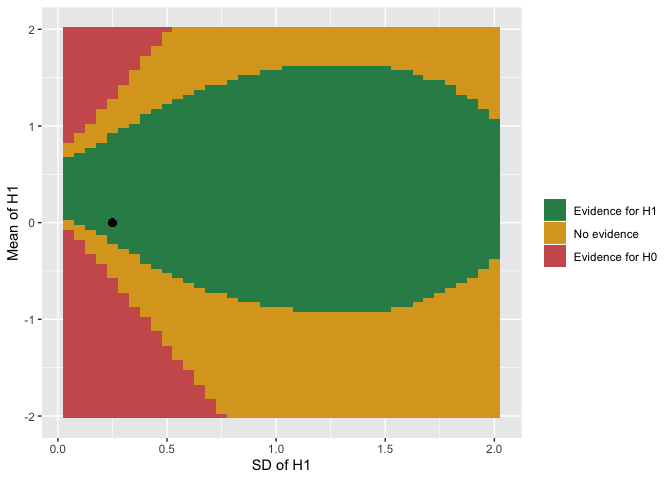
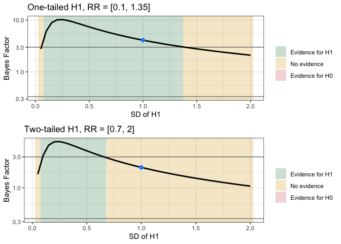

<!-- README.md is generated from README.Rmd. Please edit that file -->

# bfrr

<!-- badges: start -->

[](https://www.tidyverse.org/lifecycle/#experimental)
[](https://travis-ci.org/debruine/bfrr)
[](https://codecov.io/gh/debruine/bfrr?branch=master)
<!-- badges: end -->

Calculate Bayes Factors and robustness regions from summary statistics.

## Installation

You can install the development version from
[GitHub](https://github.com/debruine/bfrr) with:

``` r
# install.packages("devtools")
devtools::install_github("debruine/bfrr")
```

## Example

``` r
library(bfrr)
library(ggplot2)
library(cowplot)
```

First, we’ll simulate 50 data points from a normal distribution with a
mean of 0.25 and SD of 1 and conduct a one-sample t-test.

``` r
simdat <- rnorm(50, 0.25, 1)
t.test(simdat)
#> 
#>  One Sample t-test
#> 
#> data:  simdat
#> t = 2.9009, df = 49, p-value = 0.005558
#> alternative hypothesis: true mean is not equal to 0
#> 95 percent confidence interval:
#>  0.1083681 0.5970156
#> sample estimates:
#> mean of x 
#> 0.3526918
```

Set up the test using `bfrr()`.

``` r
rr <- bfrr(
  sample_mean = mean(simdat), # mean of the sample
  sample_se = sd(simdat) / sqrt(length(simdat)), # SE of the sample
  sample_df = length(simdat) - 1, # degrees of freedom
  model = "normal",
  mean = 0, # mean of the H1 distribution
  sd = 0.25, # SD of the H1 distribution
  tail = 1, # is the test 1-tailed or 2-tailed
  criterion = 6, # BF against which to test for support for H1/H0
  rr_interval = list( # ranges to vary H1 parameters for robustness regions
    mean = c(-2, 2), # explore H1 means from 0 to 2
    sd = c(0, 2) # explore H1 SDs from 0 to 2
  ),
  precision = 0.05 # precision to vary RR parameters
)
```

Use `summary(rr)` to output a summary paragraph.

``` r
summary(rr)
```

The likelihood of your data under the theoretical distribution N(0,
0.25) is 0.16. The likelihood of your data under the null distribution
T(49) is 0.01. The Bayes Factor is 20.6; this test finds evidence for H1
with a criterion of 6. The region of theoretical model parameters that
give the same conclusion is `HN([-0.2, 0.9], 0.25); HN(0, [0.1, 2])`.

Use `plot(rr)` to view a plot of your data.

``` r
plot(rr)
```



If your mean is 0 or you set the same number for the lower and upper
bounds of a parameter’s `rr_interval`, that parameter won’t vary and
you’ll get a graph that looks like this.

``` r
r1 <- bfrr(sample_mean = 0.25, tail = 1)
r2 <- bfrr(sample_mean = 0.25, tail = 2)
p1 <- plot(r1)
p2 <- plot(r2)

p1t <- paste0("One-tailed H1, RR = [", toString(r1$RR$sd), "]")
p2t <- paste0("Two-tailed H1, RR = [", toString(r2$RR$sd), "]")
cowplot::plot_grid(p1 + ggtitle(p1t), 
                   p2 + ggtitle(p2t), 
                   nrow = 2)
```


